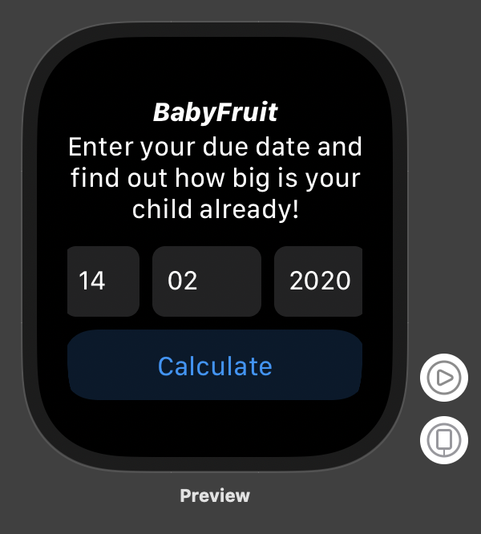
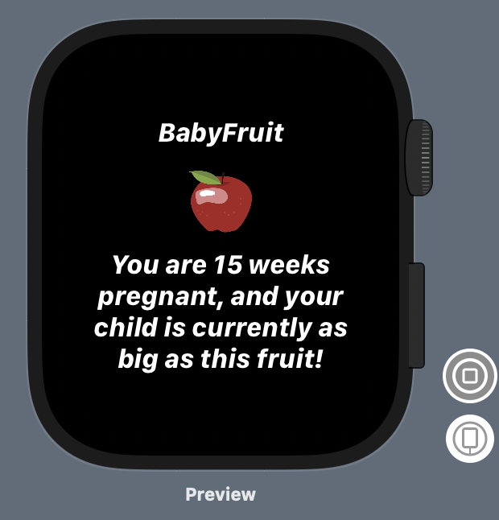

# BabyFruit
POC/Study, for creating Apple Watch (Watch OS 6) app using SwiftUI

Given a due date, the app calculate how many weeks pregnant the woman is, and shows how big their child are, compared to a fruit size.

### Screenshots

